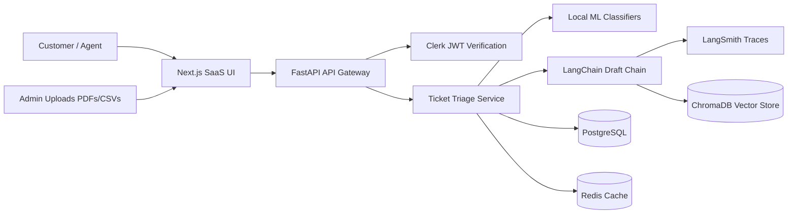
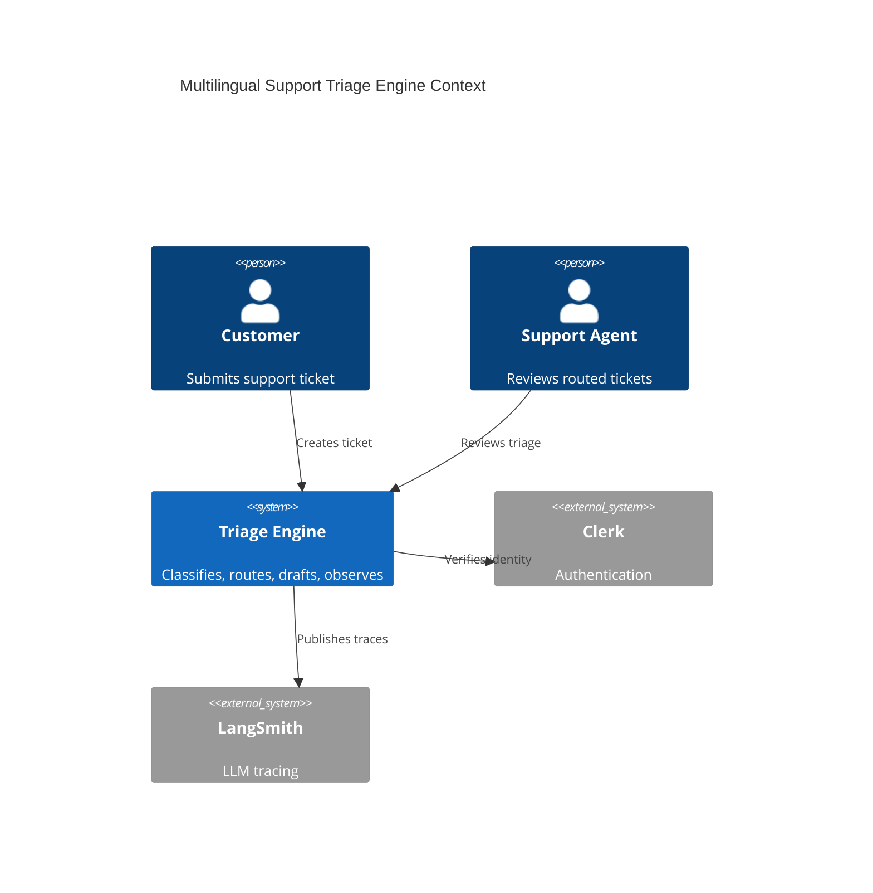
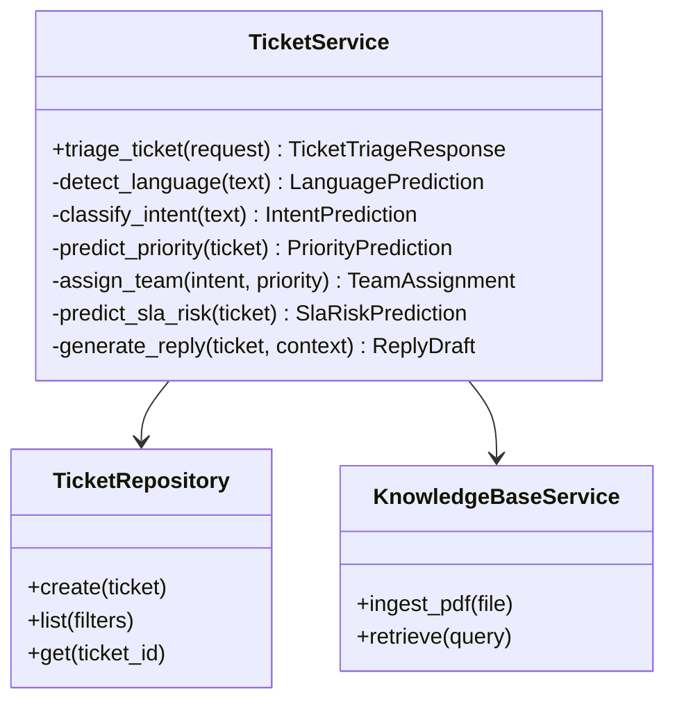
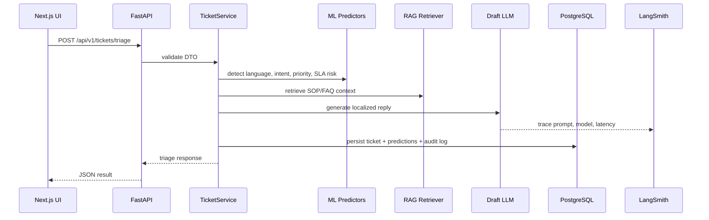
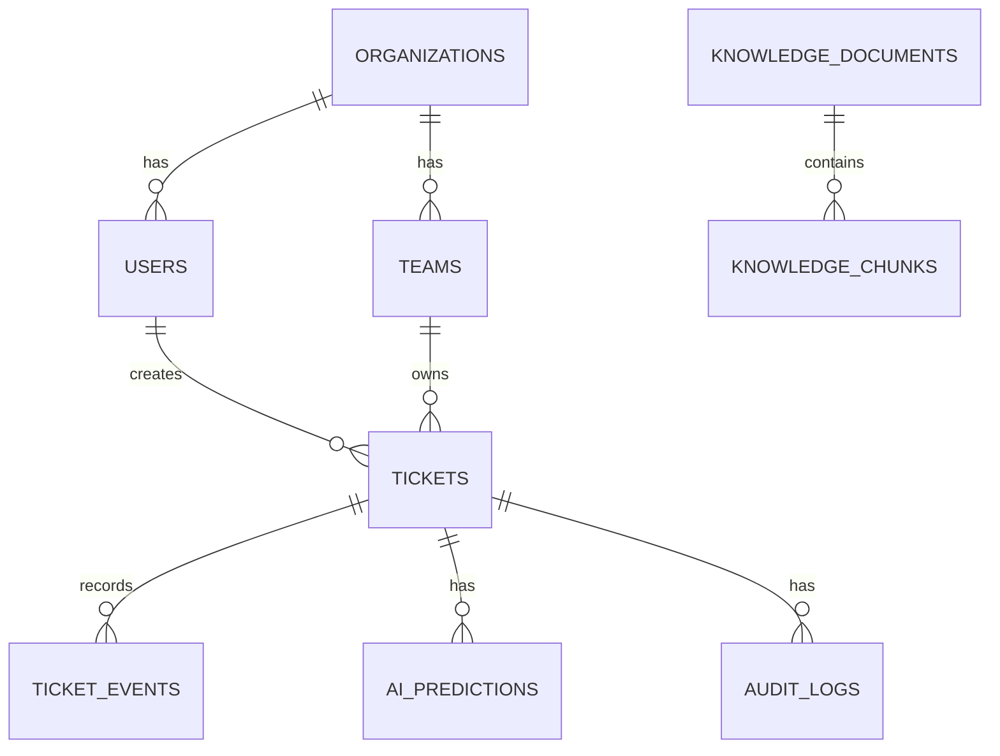

# Multilingual Support Triage Engine

> Enterprise AI support operations platform for multilingual ticket intake, triage, routing, SLA risk detection, RAG-assisted reply drafting, and observability.


## 1. Architecture Overview

We are building a startup-grade SaaS system with a typed Next.js control plane, FastAPI service APIs, PostgreSQL for operational data, Redis for caching and jobs, ChromaDB for knowledge-base vectors, and LangSmith for LLM observability.



### Why this architecture?
- **FastAPI** gives async APIs, OpenAPI docs, and clean Python typing.
- **Next.js 15** provides an app-router SaaS frontend ready for Vercel.
- **PostgreSQL** stores tickets, audit logs, teams, and predictions transactionally.
- **Redis** supports low-latency caching and future background queues.
- **ChromaDB + sentence-transformers** powers RAG over support PDFs and SOPs.
- **LangChain + LangSmith** standardizes model orchestration and observability.

### Alternatives and tradeoffs
| Area | Chosen | Alternative | Tradeoff |
|---|---|---|---|
| API | FastAPI | Django REST | FastAPI is lighter; Django ships more admin features. |
| Vector DB | ChromaDB | pgvector, Pinecone | Chroma is local-friendly; Pinecone is more operationally managed. |
| Auth | Clerk | Auth0, custom JWT | Clerk accelerates SaaS auth; custom auth gives deeper control. |
| ML | Hybrid local + LLM | LLM-only | Hybrid improves latency/cost; LLM-only can be more flexible. |

## 2. Learning Roadmap

1. **System design**: understand HLD, LLD, APIs, and database boundaries.
2. **Clean Architecture**: separate routers, services, repositories, DTOs, and models.
3. **AI triage pipeline**: language detection, intent classification, priority prediction, SLA risk, and routing.
4. **RAG**: PDF ingestion, chunking, embeddings, vector retrieval, context injection, and draft generation.
5. **Observability**: structured logs, request IDs, audit logs, and LangSmith traces.
6. **Frontend product design**: dashboards, animations, dark mode, charts, filters, and stateful UX.
7. **Productionization**: Docker, CI, environment configs, tests, and deployment notes.

## 3. Folder Structure

```text
multilingual-support-triage-engine/
├── backend/                 # FastAPI clean architecture service
│   ├── app/
│   │   ├── api/             # HTTP routers and dependencies
│   │   ├── core/            # config, logging, errors
│   │   ├── domain/          # domain entities and enums
│   │   ├── dto/             # Pydantic request/response contracts
│   │   ├── infrastructure/  # repositories, db, cache, vector store
│   │   ├── services/        # business and AI orchestration
│   │   └── main.py
│   └── tests/
├── frontend/                # Next.js 15 SaaS UI
│   ├── app/                 # app router pages
│   ├── components/          # shadcn-style components and charts
│   └── lib/                 # API client, sample data, types
├── docs/                    # system design, diagrams, teaching modules
├── .github/workflows/       # CI pipeline
├── docker-compose.yml
└── README.md
```

## 4. Step 1 — Build the core triage contract

### What we are building
A single production-minded ticket triage workflow that accepts a ticket and returns language, intent, priority, team, SLA risk, reply draft, and trace metadata.

### Why we need it
Enterprise support teams need consistent routing and prioritization before a human agent touches a ticket. This reduces response time, improves SLA compliance, and makes support operations measurable.

### Production considerations
- Use deterministic DTOs between UI and API.
- Persist both raw ticket content and AI outputs for auditability.
- Trace every AI call and prediction for debugging.
- Keep models swappable: GPT-4.1, Claude, or local fallbacks.

## System Design

### HLD


### LLD


### Triage sequence


## Database Schema



## API Contracts

| Method | Path | Purpose |
|---|---|---|
| `POST` | `/api/v1/tickets/triage` | Create and triage a ticket. |
| `GET` | `/api/v1/tickets` | List tickets with filters. |
| `GET` | `/api/v1/tickets/{ticket_id}` | Get ticket details and timeline. |
| `POST` | `/api/v1/knowledge/pdf` | Upload PDF into RAG pipeline. |
| `POST` | `/api/v1/bulk/csv` | Bulk process tickets from CSV. |
| `GET` | `/api/v1/analytics/overview` | Dashboard metrics. |

## RAG System

PDF Upload → Chunking → Embedding → ChromaDB → Retrieval → Context Injection → Response Drafting

- **Chunking** splits long PDFs into semantically useful windows. Smaller chunks improve precision; larger chunks preserve context.
- **Embeddings** convert chunks to dense vectors using sentence-transformers or domain-specific models.
- **Similarity search** finds chunks near the ticket query vector.
- **Hybrid search** combines vector similarity with keyword filters for IDs, product names, and error codes.
- **Reranking** reorders retrieved chunks with a cross-encoder or LLM judge for better final context.

## ML Components

The backend includes trainable baselines for:
1. Language classifier
2. Intent classifier
3. SLA risk predictor

Metrics tracked:
- **Precision**: when the model predicts a class, how often it is correct.
- **Recall**: how many real class examples the model finds.
- **F1**: harmonic mean of precision and recall.

## Module Teaching Pack

### Quiz
1. Why should intent classification be separated from routing?
2. When would you choose pgvector over ChromaDB?
3. What data should be included in audit logs for regulated support workflows?

### Interview Questions
1. Design an SLA prediction service that handles sparse historical data.
2. How would you evaluate multilingual reply draft quality?
3. How would you reduce LLM costs while preserving response quality?

### Production Discussion
- Use feature flags for model rollout.
- Store prediction version metadata.
- Add human override workflows.
- Track fairness and language-specific performance.

### Scaling Discussion
- Move CSV processing to a queue worker.
- Add read replicas for analytics.
- Cache repeated knowledge-base retrievals.
- Partition tickets by organization for large tenants.

## Setup

```bash
cp .env.example .env
docker compose up --build
```

Backend docs: <http://localhost:8000/docs>  
Frontend: <http://localhost:3000>

## Deployment

- Backend: deploy `backend/` to Railway with PostgreSQL and Redis plugins.
- Frontend: deploy `frontend/` to Vercel with Clerk environment variables.
- Set LangSmith variables for tracing in production.

## Future Scope

- Human feedback loop for model retraining.
- pgvector production adapter.
- Multitenant billing and metering.
- Voice ticket transcription.
- Agent assist browser extension.
