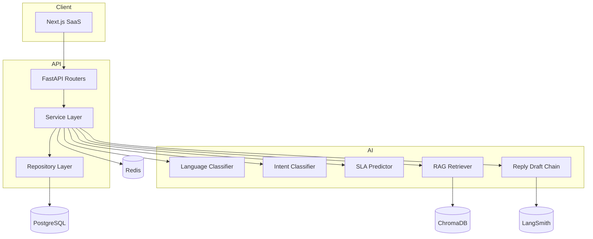

# System Design Notes

## Architecture diagram

## Commit roadmap

- `feat(architecture): add system design and project foundation`
- `feat(api): add ticket triage endpoint`
- `feat(rag): add knowledge-base retrieval boundary`
- `feat(ui): add SaaS dashboard shell`
- `ci: add backend and frontend validation workflow`
